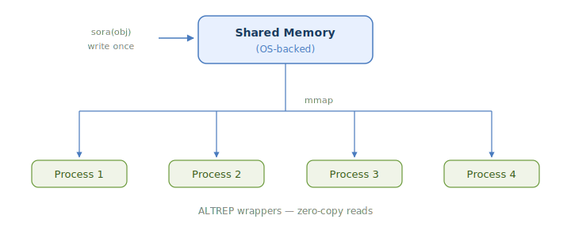

<!-- README.md is generated from README.Rmd. Please edit that file -->

# sora

<!-- badges: start -->

[](https://github.com/shikokuchuo/sora/actions/workflows/R-CMD-check.yaml)
<!-- badges: end -->

      ________
     /\ sora  \
    /  \       \
    \  /  空   /
     \/_______/

Shared Objects for R Applications

→ `sora()` writes an R object into shared memory and returns a shared
version

→ ALTREP serialization hooks — shared objects serialize compactly

→ ALTREP-backed lazy access — columns materialize on first touch, not
before

→ OS-level shared memory (POSIX / Win32), no external dependencies

→ Automatic cleanup — shared memory is freed by R’s garbage collector

<br />

### Installation

``` r
install.packages("sora", repos = "https://shikokuchuo.r-universe.dev")
```

### Quick Start

`sora()` writes an R object into shared memory and returns a shared
version backed by zero-copy ALTREP. Shared objects serialize compactly
via ALTREP serialization hooks, working transparently with mirai and any
R serialization path. Shared memory is automatically freed when the
object is garbage collected.

``` r
library(sora)

# Share a vector — returns an ALTREP-backed object
x <- sora(rnorm(1e6))
mean(x)
#> [1] -0.0009597292

# Serialized form is ~100 bytes, not ~8 MB
length(serialize(x, NULL))
#> [1] 124
```

### Sharing by Name

`shared_name()` extracts the SHM name from a shared object.
`map_shared()` opens a shared region by name — useful for accessing the
same data from another process without serialization:

``` r
x <- sora(1:1e6)

# Extract the SHM name
nm <- shared_name(x)
nm
#> [1] "/sora_b589_1"

# Another process can map the same region by name
y <- map_shared(nm)
identical(x[], y[])
#> [1] TRUE
```

### Use with mirai

Shared objects can be sent to local daemons — the ALTREP serialization
hooks ensure only the SHM name crosses the wire, and the worker maps the
same physical memory.

``` r
library(lobstr)
library(mirai)

daemons(1)

x <- sora(rnorm(1e6))

# Worker maps the same shared memory — 0 bytes copied
m <- mirai(list(mean = mean(x), size = lobstr::obj_size(x)), x = x)
m[]
#> $mean
#> [1] 0.001674302
#> 
#> $size
#> 792 B

daemons(0)
```

Elements of a shared list also serialize compactly — each element
travels as a reference to its position in the parent shared region, not
as the full data:

``` r
daemons(4)

# Share a list — all 4 vectors in a single shared region
x <- sora(list(a = rnorm(1e6), b = rnorm(1e6), c = rnorm(1e6), d = rnorm(1e6)))

# Each element is sent as (parent_name, index) — zero-copy on the worker
mirai_map(x, \(v) list(mean = mean(v), size = lobstr::obj_size(v)))[.flat]
#> $a.mean
#> [1] 0.0003616497
#> 
#> $a.size
#> 728 B
#> 
#> $b.mean
#> [1] 0.001056395
#> 
#> $b.size
#> 728 B
#> 
#> $c.mean
#> [1] -0.0011767
#> 
#> $c.size
#> 728 B
#> 
#> $d.mean
#> [1] 0.001649881
#> 
#> $d.size
#> 728 B

daemons(0)
```

### Why sora

Parallel computing multiplies memory. When 8 workers each need the same
210 MB dataset, that is 1.7 GB of serialization, transfer, and
deserialization — plus 8 separate copies consuming RAM.

sora eliminates all of it. `sora()` writes data into shared memory once.
Each worker maps the same physical pages, receiving a reference of ~300
bytes instead of the full dataset — a 700,000x reduction:

``` r
n <- 5000000L

set.seed(42)
df <- data.frame(
  x1 = rnorm(n), x2 = rnorm(n), x3 = rnorm(n),
  x4 = runif(n), x5 = runif(n),
  group = sample.int(100L, n, replace = TRUE)
)

shared_df <- sora(df)

# Per-task payload: ~210 MB vs ~300 bytes
length(serialize(df, NULL))
#> [1] 220000263
length(serialize(shared_df, NULL))
#> [1] 304
```

Memory savings this large translate directly into performance. Less
serialization, less transfer, less allocation — each worker starts
computing sooner and the system spends less time moving data:

``` r
boot_means <- function(seed, data) {
  set.seed(seed)
  idx <- sample.int(nrow(data), replace = TRUE)
  colMeans(data[idx, ])
}

seeds <- seq_len(8L)
daemons(8)

# Without sora — each daemon deserializes a full copy
system.time(mirai_map(seeds, boot_means, data = df)[])
#>    user  system elapsed 
#>   2.362  44.225   6.610

# With sora — each daemon maps the same shared memory
system.time(mirai_map(seeds, boot_means, data = shared_df)[])
#>    user  system elapsed 
#>   1.501  29.514   4.409

daemons(0)
```

### How It Works

sora operates in two tiers depending on the object:

**Tier 2 — zero-copy (ALTREP).** All atomic vectors — including
character vectors and those with attributes (factors, Dates, named
vectors, etc.) — and data frame columns are written directly into shared
memory. Pairlists are coerced to lists and handled the same way.
`sora()` returns ALTREP wrappers that point into the shared pages — no
deserialization, no per-process memory allocation. A data frame with 10
columns lives in a single shared region; a task that touches 3 columns
pays for 3. Character strings are accessed lazily per element.

**Tier 1 — pass-through.** All other R objects (environments, closures,
language objects) are returned unchanged by `sora()`.

<figure>

<figcaption aria-hidden="true">Diagram showing sora() writing an object
once into OS-backed shared memory, which is then memory-mapped by other
processes using zero-copy ALTREP wrappers</figcaption>
</figure>

### Automatic Lifetime Management

Shared memory is managed by R’s garbage collector. The SHM region stays
alive as long as the shared object (or any element extracted from it) is
referenced in R. When no references remain, the garbage collector frees
the shared memory automatically.

**Important:** Always assign the result of `sora()` to a variable. The
shared memory is kept alive by the R object reference — if the result is
used as a temporary (not assigned), the garbage collector may free the
shared memory before a consumer process has mapped it.

### Copy-on-Write

Shared data is mapped read-only. Mutations are always local — R’s
copy-on-write mechanism ensures other processes continue reading the
original shared data:

- **Structural changes** to a list or data frame (adding, removing, or
  reordering elements) produce a regular R list. The shared region is
  unaffected.
- **Modifying values** within a shared vector (e.g., `X[1] <- 0`)
  materializes just that vector into a private copy. Other vectors in
  the same shared region stay zero-copy.
